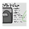

<ImageCard height='auto' width='auto' src="../../assets/map_sk_base.png">
    The Skeld
</ImageCard>

# アドミン(Admin)
指令室。ここは各部屋に何人いるのかをモニタリングできる素晴らしい部屋。  
ここをチェックしていると、招集時の会議で誰が嘘の行動をしていたか、ベント移動をしていたかが見抜けるかもしれない。  
緊急タスクのO2があったり、カフェテリアも近いので出入りは激しい。

## 位置センサー
<ImageCard height='auto' width='auto' src="../../assets/admin.png" />

## タスク
| | 名称 | 位置 | メモ |
| :-- | :-- | :-- | :-- |
|  | アップロード | 右上 | ダウンロード->アップロードの順なのでDLタスクがあれば必然的にこちらも立ち寄る |
|  | 配電盤結線 | 入口前廊下 |  |
|  | カードスワイプ認証 | テーブル奥 | 速すぎても遅すぎてもダメ |

## 緊急タスク(酸素放出)
暗証番号を入力してOK
<ImageCard height='auto' width='auto' src="../../assets/task_o2.png" />

## ベント

