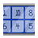

<ImageCard height='auto' width='auto' src="../../assets/map_sk_base.png">
    The Skeld
</ImageCard>

# リアクター(Reactor)
ここも緊急タスクやセキュリティが近いので比較的で入りがあるところ。  
特別なタスクが多いのと、右上の受電スイッチオンスイッチはフェイクなので嘘をつく際は注意を。

## タスク
| | 名称 | 位置 | メモ |
| :-- | :-- | :-- | :-- |
|  | マニフォールド解除 | 左上 | 1から順番に押していけばOK |

## タスク(リアクター再始動)
音ゲー。5回連続で位置を覚える必要があるが、順番は1回増えるごとに前回の継ぎ足しになるので焦らなくても最後だけ注視しておけば大丈夫。
(`1 -> 2`で来たら3回目は`1 -> 2 -> 8`になり、4回目は`1 -> 2 -> 8 -> 4`のようになる)

<ImageCard height='auto' width='auto' src="../../assets/task_reactor_start2.png" />
<ImageCard height='auto' width='auto' src="../../assets/task_reactor_start.png" />

## 緊急タスク(リアクターメルトダウン)
上下にスイッチがあるので、二人同時に手を合わせてバルスすればメルトダウンを防げる。  
二人同時に合わせている瞬間があればいいので、長押しして相方を待っておけばOK。

<Layout>

<ImageCard height='auto' width='auto' src="../../assets/task_reactor_melt3.png" />

<ImageCard height='auto' width='auto' src="../../assets/task_reactor_melt2.png" />

<ImageCard height='auto' width='auto' src="../../assets/task_reactor_melt.png" />

</Layout>

