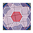

<ImageCard height='auto' width='auto' src="../../assets/map_sk_base.png">
    The Skeld
</ImageCard>

# シールド(Shields)
船を守る部分。あまりタスクも多くないので特筆事項なし。

## タスク
| | 名称 | 位置 | メモ |
| :-- | :-- | :-- | :-- |
|  | 受電スイッチオン | 右上 |  |
|  | シールド修理 | 左下 |  |

## ベント

